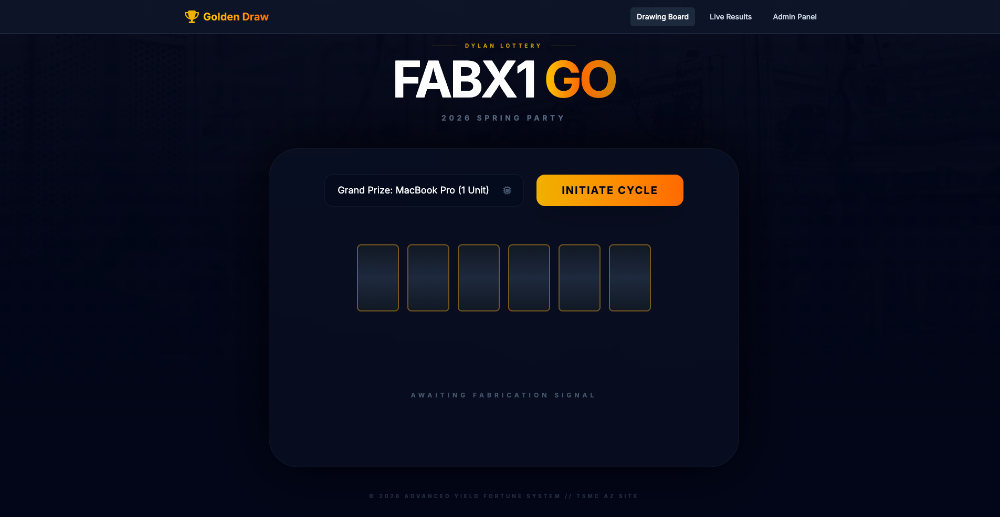
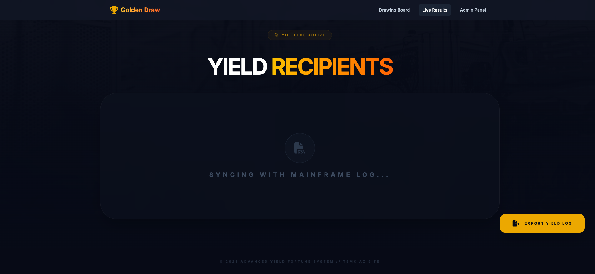
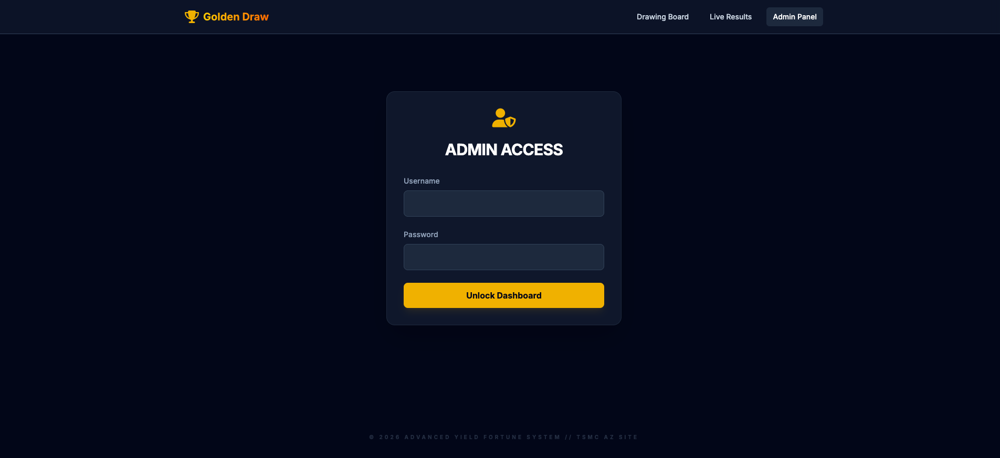

# Run and deploy your AI Studio app

This contains everything you need to run your app locally.

View your app in AI Studio: https://ai.studio/apps/drive/1spX11bHwIDlQzwOlLoXXseX83iKycFyp

## Run Locally

**Prerequisites:**  Node.js

1. Install dependencies:
   `npm install`
2. Set the `GEMINI_API_KEY` in [.env.local](.env.local) to your Gemini API key
3. Run the app:
   `npm run dev`

---

## Features (功能介紹)

### Drawing Board (抽獎板頁面)

This page is where the lottery drawing process is initiated. Users can select the prize segment and trigger the drawing cycle.

此頁面是啟動彩票抽獎過程的地方。用戶可以選擇獎品區段並觸發抽獎循環。

### Live Results Page (即時結果頁面)

This page displays the live results of the lottery draws. Winners are presented in a clear, tabular format for easy overview. When data is loading, a "Syncing with Mainframe Log..." message is shown.

此頁面顯示彩票抽獎的即時結果。中獎者以清晰的表格形式呈現，方便快速瀏覽。當數據載入時，會顯示「正在同步主機日誌...」訊息。

_Note: The screenshot above shows the loading state of the Live Results page. Once data is available, winners will populate the table._
_注意：以上截圖顯示了即時結果頁面的載入狀態。一旦數據可用，中獎者將填充表格。_

### Admin Panel (管理面板頁面)

This page provides administrative access to manage the lottery system. It typically requires authentication to access sensitive configurations or data.

此頁面提供管理員對彩票系統的管理權限。通常需要身份驗證才能訪問敏感配置或數據。

