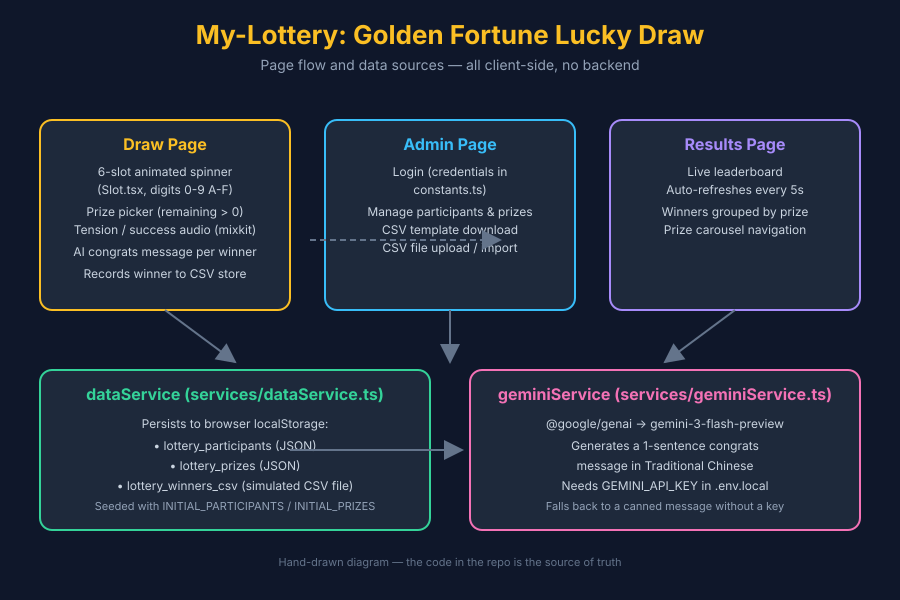

# My-Lottery — Golden Fortune Lucky Draw

A premium lucky-draw web app with a 6-slot animated spinner, admin prize/participant management, a live results leaderboard, Gemini AI-generated congratulation messages, and atmospheric audio. Everything runs client-side with data persisted in the browser (no backend).



## Features

- **Draw page** — Pick a prize and run the draw on a slot-machine-style spinner (`Slot.tsx` cycles digits 0–9, A–F). Tension audio plays while spinning, a success sound on reveal; winners get a one-sentence congratulatory message in Traditional Chinese generated by Gemini AI. Each draw decrements the prize's remaining count.
- **Admin page** — Login-protected management of participants and prizes. Download CSV templates and import participant/prize lists from CSV files.
- **Results page** — Live leaderboard of winners, grouped by prize, auto-refreshing every 5 seconds, with prize carousel navigation.
- **Simulated CSV persistence** — Participants, prizes, and winners are stored in `localStorage` (winners as CSV text under `lottery_winners_csv`), seeded with demo data from `constants.ts`.

## Tech Stack

| Area | Technology |
|---|---|
| UI | React 19 + TypeScript, Tailwind-style utility classes |
| Build | Vite 6 |
| AI | `@google/genai` (`gemini-3-flash-preview`) |
| Audio | Remote SFX from mixkit (tension loop + success jingle) |
| Storage | Browser `localStorage` (no backend) |

## Project Structure

```
My-Lottery/
├── App.tsx                  # Page router: DRAW / ADMIN / RESULTS
├── types.ts                 # Participant, Prize, Winner, Page
├── constants.ts             # ADMIN_CREDENTIALS, demo participants/prizes, storage keys
├── components/
│   ├── DrawPage.tsx         # Slot-machine draw flow + AI congrats message
│   ├── Slot.tsx             # Single spinning digit reel
│   ├── AdminPage.tsx        # Login + participant/prize CSV management
│   ├── ResultsPage.tsx      # Winners leaderboard (5s auto-refresh)
│   └── Navbar.tsx           # Page navigation
├── services/
│   ├── dataService.ts       # localStorage + simulated-CSV persistence layer
│   └── geminiService.ts     # Gemini congratulatory-message generator
├── index.tsx / index.html   # Entry point
└── vite.config.ts           # Dev server :3000, GEMINI_API_KEY wiring
```

## Run Locally

Prerequisites: Node.js.

```bash
npm install
npm run dev      # Vite dev server → http://localhost:3000
```

Optional: set `GEMINI_API_KEY` in `.env.local` to enable AI-generated congratulatory messages. Without it, the app still works and falls back to a built-in message.

Other scripts (from `package.json`):

```bash
npm run build    # vite build → dist/
npm run preview  # preview the production build
```

## Notes

- Default admin credentials are defined as `ADMIN_CREDENTIALS` in `constants.ts` — change them before any real event.
- Demo participants (10) and prizes (MacBook Pro ×1, iPhone ×3, AirPods Pro ×5) ship in `constants.ts`; import your real list via CSV on the Admin page.
- All draw data lives in the browser's `localStorage`. Clearing site data resets participants, prizes, and winner history.

## License

No LICENSE file in the repo.
